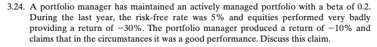
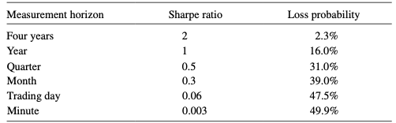
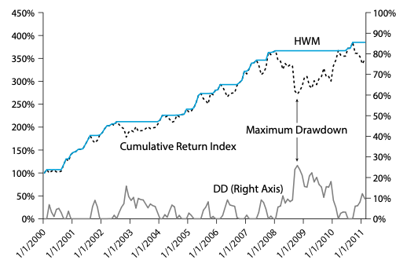

# Chapter2 Evaluating Trading Strategies - Performance Measures

윤준기

---
## Intro.
- 트레이딩을 잘하고 있음을 어떻게 측정할 수 있을까?
- hedge fund 전략의 `순수 실력` 판별하기

---
## Table of Contents
- [2.1 Alpha and Beta](#21-alpha-and-beta)
- [2.2 Risk-Reward Ratios](#22-risk-reward-ratios)
- [2.3 Estimating Performance Measures](#23-estimating-performance-measures)
- [2.4 Time Horizons And Annualizing Performance Measures](#24-time-horizons-and-annualizing-performance-measures)
- [2.5 High Water Mark](#25-high-water-mark)
- [2.6 Drawdown](#26-drawdown)
- [2.7 Adjusting Performance Measures For Illiquidity and Stale Prices](#27-adjusting-performance-measures-for-illiquidity-and-stale-prices)
- [2.8 Performance Attribution](#28-performance-attribution)
- [2.9 Backtests vs Track Records](#29-backtests-vs-track-records)
---
## 2.1 Alpha and Beta
---
### $R_t$(simple return)
return으로 비교하는 것이 바람직한가?

- portfolio manager: "나는 10% 잃었지만 주식 시장은 30% 하락했으니 잘한거야!"

---
### $R_t^e = \alpha + \beta R_t^{M,e} + \epsilon_t$
- $R_t^e(=R_t-R^f)$: risk-free rate 대비 나의 `초과` 수익률
- $R_t^{M,e}(=R_t^M-R^f)$: risk-free rate 대비 마켓 `초과` 수익률
- $\alpha$, $\beta$는 regression으로 얻는다.
- $\epsilon_t$: idiosyncratic risk
  - diversifiable risk
  - $+$, $-$, 0
  - independent of market moves
  - 특정 업계, 자산
---
### $\beta$를 알아야 하는 이유
- beta risk는 잘 사라지지 않는다.
- idiosyncratic risk는 분산되어 사라진다.
- market exposure("$\beta$ risk") 때문에 비싼 돈을 쓰지 말아라!
  - index funds, ETF, futures contracts로 저렴한 비용으로 얻을 수 있음
---
### market-neutral
- $\beta = 0$
- $\text{market-neutral excess return} = R_t^e = \alpha + \epsilon_t$
- $E[\text{market-neutral excess return}] = E[\alpha] + E[\epsilon_t] = \alpha$
---
### $\beta$ & hedge funds
- hedge fund는 market neutral해야함
- 시장과 별개로 절대적인 수익을 내야함($\alpha$)
---
### 내 전략을 market-neutral하게 만들기
- hedge ratio
  - $\beta \frac{V_A}{V_F}$
    - Hull 책 `Changing the Beta of a Portfolio`
- $R_t^e = \alpha + \beta R_t^{M,e} + \epsilon_t$
  - $R_t^e - \beta R_t^{M, e} = \alpha + \epsilon_t$
---
### CAPM(Capital Asset Pricing Model) - `classic`
- $R_t^e = \beta R_t^{M,e}$
- $\epsilon_t=0$
- $\alpha = 0$
  - hedge funds는 $\alpha > 0$에 도전함
---
#### CAPM vs hedge fund
- hedge fund가 이겼다고 할 수 있는 최소의 $\alpha$
- $H_0: \alpha = 0$ vs $H_1: \alpha \neq 0$
- $\text{t-stat} > 2 \Longrightarrow H_1$
- $\text{t-stat} < 2 \Longrightarrow H_0$
---

---
### Fama-French(3)
$$R_t^e = \alpha + \beta^MR_t^{M, e} + \beta^{HML}R_t^{HML} + \beta^{SMB}R_t^{SMB} + \epsilon_t$$
- `HML(High Minus Low)`
  - `B/M(book-to-market ratio)` 기준 높은 주식이 낮은 주식보다 수익률이 높음
  - `PBR` 기준 낮은 주식이 높은 주식보다 수익률이 높음
  - `value risk`
- `SMB(Small Minus Big)`:
  - 소형주가 대형주보다 수익률이 높음
  - `size risk`
---
## 2.2 Risk-Reward Ratios
---
### `alpha`의 한계
- `alpha`는 `risk`에 대해서는 설명하지 못함
- `alpha`는 규모에 따라 커짐
  - 2배 레버리지 vs unleveraged
  - performance measure로서 적합할까?
  - 전략의 본질은 바뀌지 않음
---
### Sharpe Ratio
$$\text{SR} = \frac{E(R - R^f)}{\sigma(R-R^f)}$$
- risk 대비 return이 얼마인가
---
### Information Ratio
$$\text{IR} = \frac{\alpha}{\sigma(\epsilon)}$$
- $\alpha$, $\epsilon$를 어떻게 구하죠?
  - $R_t^e = \alpha + \beta R_t^{b, e} + \epsilon_t$ 에 대해 regression
---
#### 특정 벤치마크 대비
$$\text{IR} = \frac{E(R-R^b)}{\sigma(R-R^b)}$$
- 대부분 hedge fund에서 benchmark가 physical cash라고 함 ($\Longrightarrow R_b = 0$)
$$\text{IR} = \frac{E(R)}{\sigma(R)} \ge \text{SR}$$
---
### _You can't eat risk-adjusted returns_
- risk-free 대비 3% 수익, risk는 2% $\Longrightarrow \text{SR} = 1.5$
- investor: `Well, it's still just 3%. I was hoping for more return.`
- risk가 정말 낮은가?
  - 운 좋게 큰 일이 벌어지지 않은 것은 아닌가?
  - e.g. OTM put option 매도로 option premium을 가져가는 상황
- leverage를 더 쓸 수 있는가?
  - investor에게 돈을 더 넣으라고 할 거야?
- internal leverage?
  - 얼마나 가능해?
---
### AM(alpha-to-margin) ratio
$$AM = \frac{\alpha}{\text{margin}}$$
- maximum leverage
  - $\frac{1}{\text{margin}}$
  - e.g. margin requirement가 10%면 최대 10배 레버리지 가능
---
### AM ratio - examples
- $\text{capital} = 100\$$ 
- $\alpha = 3\%, \text{margin requirement} = 10\%$
  - $\text{investment} = 1000\$$
  - $\text{excess return} = 30\$$
  - $\text{AM} = 30\%$
- $\alpha = 7\%$, leverage 못 쓰는 경우
  - $\text{investment} = 100\$$
  - $\text{excess return} = 7 \$$
  - $\text{AM} = 7 \%$
---
### AM $\simeq$ ROE(Return On Equity)
  - AM: margin(증거금) 대비 얼마나 벌었나?
  - ROE: 자기자본 대비 얼마나 벌었나?
---
### AM & IR
$$\text{AM} = \frac{\alpha}{\text{margin}} = \text{IR} \times \frac{\sigma(\epsilon)}{\text{margin}}$$
- [IR의 정의](#information-ratio)
---
### RAROC(Risk-Adjusted Return On Capital)
- crash risk를 무시할 수 없다면 volatility가 best risk measure가 아님
$$\text{RAROC} = \frac{E(R-R^f)}{\text{economic capital}}$$
---
### economic capital
- 최악의 손실을 버티기 위한 최소 자본
- 어떻게 추정할까?(chapter 4.2)
  - VaR: value-at-risk
  - stress tests
---
### Sortino ratio
$$S = \frac{E(R - R^f)}{\sigma(R1_{\{R < MAR\}})}$$
- 분모를 downside risk(or downside deviation)라고 함
- `MAR(minium accepted rate)`는 $R^f$ 또는 $0$
- MAR 보다 높은 변동성은 포함하지 않는 방식
---
## 2.3 Estimating Performance Measures
---
### Geometric Average vs Arithmetic Average
$$1 + \text{geometric average} = (\Pi_{1 \le i \le T}(1+R_i))^{1/T}$$
$$\text{arithmetic average} = \frac{\Sigma_{1 \le i \le T}R_i}{T}$$
$$1 + \text{arithmetic average} = \frac{\Sigma_{1 \le i \le T}(1+R_i)}{T}$$
 

$$\text{arithmetic average} \ge \text{geometric average}$$
---
### 언제 사용할까?
- arithmetic
  - 일정한 달러를 투자
  - optimal estimator from statistical point of view
- geometric
  - buy-and-hold
- noise
  - 기대 수익률을 정확히 측정하는 것은 어렵다
---
### standard deviation $\sigma$
- variance($\sigma^2$)을 추정함
- $\bar{R}$: arithmetic average
- $\text{variance estimate} = \frac{\Sigma_{1 \le i \le T}(R_i - \bar{R})^2}{T-1}$
---
## 2.4 Time Horizons And Annualizing Performance Measures
---
### table 2.1

---
- time horizon을 명확하게 할 것
- 서로 다른 두 전략의 performance를 비교할 때는 time horizon을 통일하라.(보통 연 단위)
---
### Time Horizon 변환 - arithmetic average
$n$: number of perdios per year
$$\text{ER}^{\text{annual}} = \text{ER} \times n$$
---
### Time Horizon 변환 - geometric average
$$\text{ER}^{\text{annual}} = (1 + \text{ER})^n - 1$$
$$1 + \text{ER}^{\text{annual}} = (1 + \text{ER})^n$$
---
### Variance
- $\text{var}^{\text{annual}} = \text{var} \times n$
- $\sigma^{\text{annual}} = \sigma \times \sqrt{n}$
---
### Sharpe Ratio
$$\text{SR}^{\text{annual}} = \frac{\text{ER}^{\text{annual}}}{\sigma^{\text{annual}}} = 
\frac{\text{ER} \times n}{\sigma \times \sqrt{n}} =
\text{SR} \times \sqrt{n}$$
---
### 얼마나 자주 P&L을 관측해야하는가?
$$P(R^e < 0) = P(E(R^e) + \sigma N < 0) = P(N < -SR), N \sim N(0, 1)$$

Assume $R^e \sim N(\mu, \sigma^2)$, then $(R^e - \mu) / \sigma \sim N(0, 1)$
$P(R^e < 0) = P((R^e - \mu) / \sigma < -\frac{\mu}{\sigma}) = P(N < -\text{SR})$

[table](#table-21)

---
## 2.5 High Water Mark
---
$$HWM_t = \max_{s \le t}P_s$$

---
## 2.6 Drawdown
---
### Risk Measure
$$DD_t = \frac{HWM_t - P_t}{HWM_t}$$
$$MDD_T = \max_{t \le T}DD_t$$
---

---
## 2.7 Adjusting Performance Measures For Illiquidity and Stale Prices
---
### Mark to Market
- 자산, 부채를 `시장 가격` 기준으로 평가하는 것
---
### LCM(Late Capital Management)
- 주식 100%
- `mark to market`을 한 달 늦게 하는 회사
  - e.g. 주식 시장이 1월 3% 성장한 것을 2월 수익으로 보고
---
### LCM의 $\alpha$
$$cov(R_t^{LCM, e}, R_t^{M, e}) = cov(R_{t-1}^{M, e}, R_t^{M, e}) \cong 0$$
$$R_t^{LCM, e} = \alpha + \beta R_t^{M,e} + \epsilon_t$$
$$R_t^{LCM, e} \cong \alpha$$
---
### Illiquid Exchange Trades
- 거래가 잘 안 되므로 월 종가가 `stale`하다.
- OTC market에서는 더 심각하다.
- stale price는 시장의 변동성을 제대로 반영하지 못한다.
- $\beta$가 잘못 측정되어 $\alpha$가 크다는 오류
- $R_t^e = \alpha^{\text{adjusted}} + \Sigma_{0 \le i \le L}\beta_{i}R_{t-i}^{M, e} + \epsilon_t$
- 과거 return도 반영해야한다는 의미(lagged time periods)
---
### LCM 다시 보기
$$R_t^e = R_{t-1}^{M, e} = 0 + 0 \cdot R_0^{M, e} + 0 \cdot R_1^{M, e} + \cdots + 1 \cdot R_{t-1}^{M, e} + 0 \cdot R_t^{M, e}$$

$$\beta^{\text{all-in}} = \Sigma_{0 \le i \le L}\beta_{i} = \beta_{t-1} = 1$$
$$\alpha^{\text{adjusted}} = 0$$
---
$$\text{IR}^{\text{adjusted}} = \frac{\alpha^{\text{adjusted}}}{\sigma(\epsilon)}$$
---
## 2.8 Performance Attribution
---
### Performance Attribution
- 어떤 factor가 수익의 요인인지 리뷰함
- investor
  - hedge fund의 세부사항을 알 수 있음
    - investment process
    - drivers of returns
    - risk factors
- (hedge fund's) internal
  - 의사 결정에 활용

---
## 2.9 Backtests vs Track Records
---
### gross versus net(비용 고려 전 vs 후)
- tx costs, fees
- investor들에게는 net이 중요함
---
### Track Record
- tx costs, fees 등 모두 반영한 최종 실현 수익
- hedge fund마다 fee가 다르기 때문에 가장 보수적인 것을 기준으로 생각해야함
---
### Backtests
- 특정 전략(strategy)이 과거에는 어땠을지 성능을 측정해보는 것
---
### Backtest Steps
- step1) backtest로 gross return 확인
- step2) tx costs가 포함되어도 괜찮을까?
- step3) investor에게 이득이 되는가?